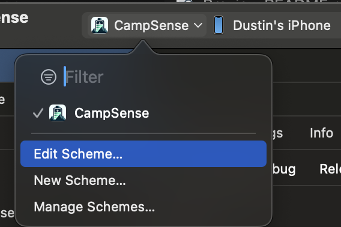
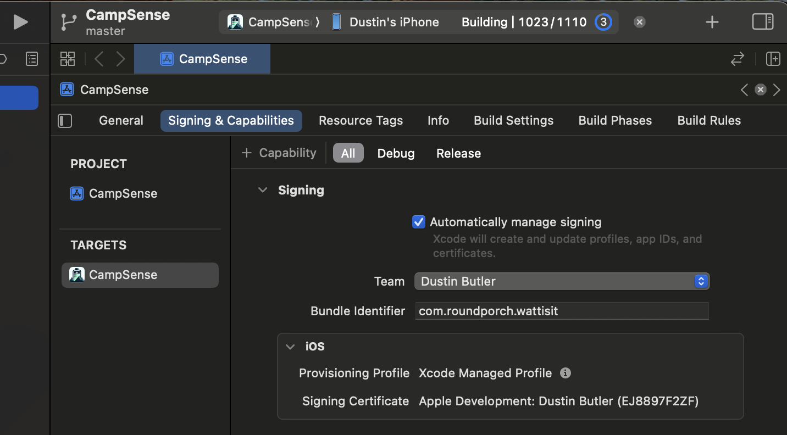

# iOS Installation

Install dependencies

`npm install`

Build for ios

`npx expo prebuild --platform ios`

Open `ios/CampSense.xcworkspace` in Xcode.  Edit the scheme and change the Build Configuration to Release.  This will install a release version not dependent on an expo dev server.

 Select a team under Signing & Capabilities, click play to build the project to your iPhone.

