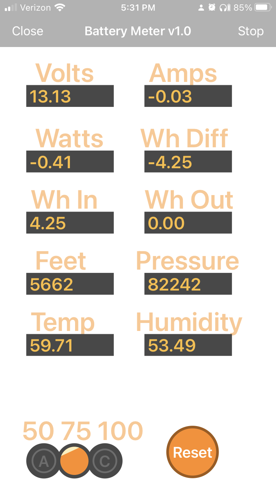

## Remote XY

Before the Camp Sense app Remote XY was used for development. The sketch is in `Arduino/RemoteXY`.

The Remote XY is a free app is used to view data with bluetooh. This also has a setting for the shunt 50, 75, or 100 mV. The setting is persisted in eeprom (flash memory)

https://remotexy.com/en/editor/391325040dffc13fc4e74f019a2b24ee/

