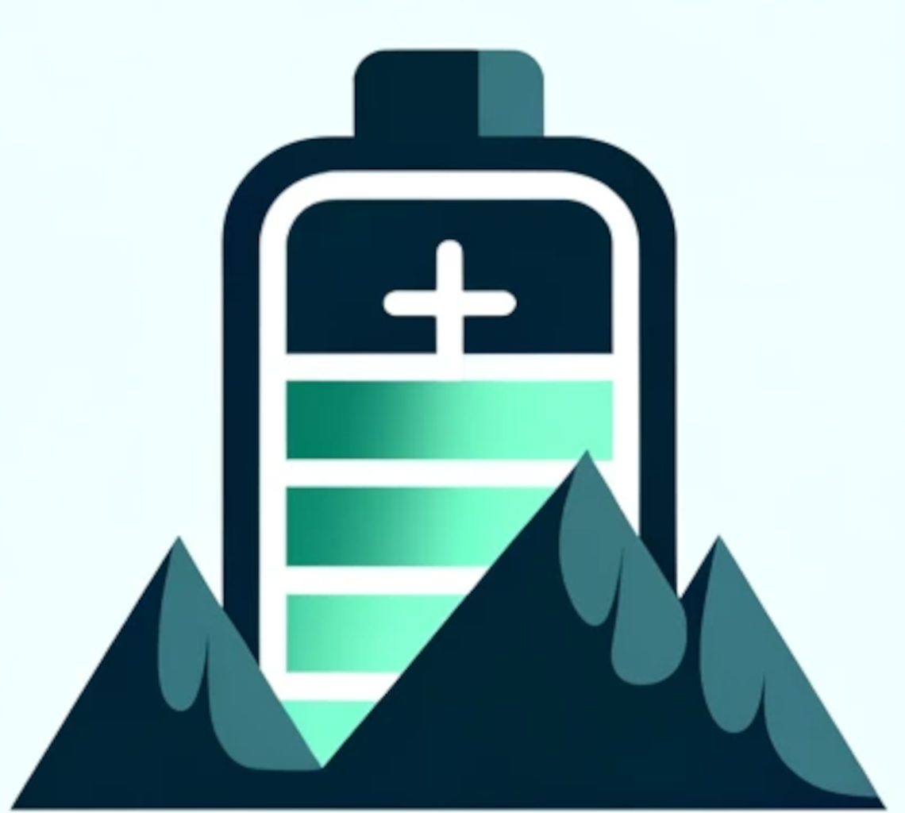
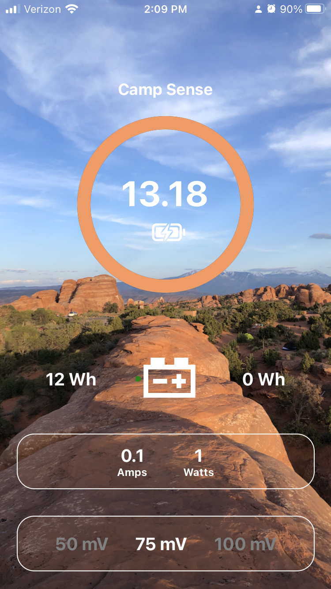
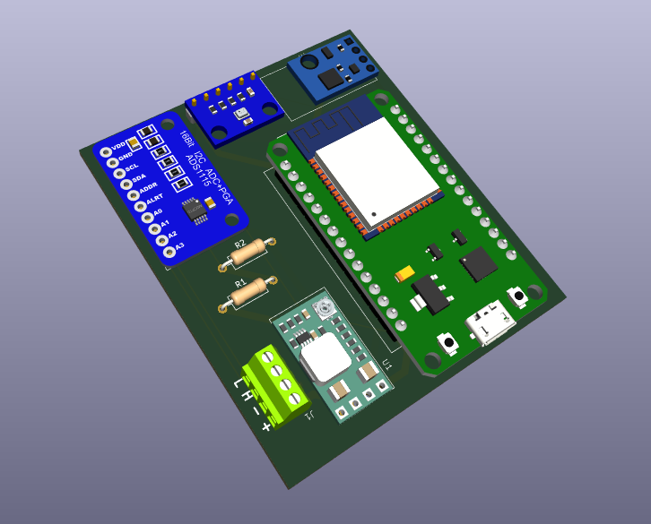
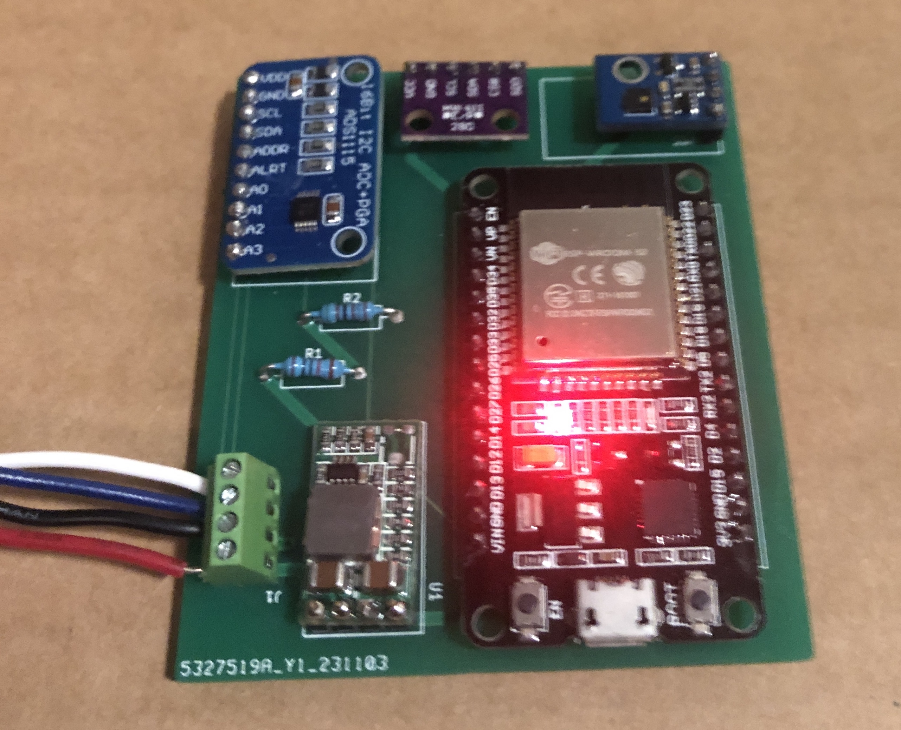

# Camp Sense 

 The Camp Sense app connects to the WattIsIt ESP32 hardware module via bluetooth and displays the battery energy usage and weather data. 

The app shows current amps into (charging) or out (discharging).   A total count shows how many watt hours went into and out of the battery. Long press the battery on screen to reset the Wh counters.

Your shunt will have a voltage drop rating of 50mmV, 75mV or 100mV.  Long press the setting to set this for your shunt resistor.

Access the weather screen by swiping left (and right on weather to return).
The `App` folder contains
the React Native app developed using Expo.

|                     Energy                     |                    Weather                    |
| :--------------------------------------------: | :-------------------------------------------: |
|  |  |

# WattIsIT

A battery watt meter using ADS1115 and a shunt to measure power usage. There are 2 Arduino sketches, `Arduino/RemoteXY` and `Arduino/Camp Sense`. The latter uses Platform IO plugin for VSCode and works with the Camp Sense app.

## BOM

AHT21 is optional, was used for humidity but also has a temperature sensor.

| Item           | Link                   |
| -------------- | ---------------------- |
| U2 ESP32       | https://a.co/d/88cG9Z5 |
| M1 ADS1115     | https://a.co/d/gfCO6jt |
| U1 Voltage Reg | https://a.co/d/cpmFpuU |
| U4 AHT21       | https://a.co/d/6xBWBLx |
| U3 BMP280      | https://a.co/d/1HV9oyw |
| J1 Terminals   | https://a.co/d/8nVocXb |
| Shunt          | https://a.co/d/7QWWK5O |
| R1 10k Ohm     | https://a.co/d/6f4wvqz |
| R2 5k Ohm      | https://a.co/d/adCeki6 |

## Version 1.0

|                KiCad Model                |                 In Use                  |
| :---------------------------------------: | :-------------------------------------: |
|  |  |

## Screw Connections

\+ 12 volt + \
\- 12 volt - \
L Low side of shunt \
H High side of shunt

