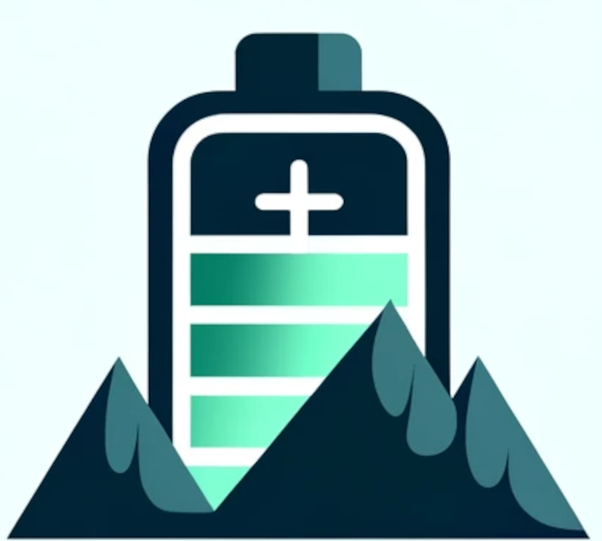

# Camp Sense

**Battery energy monitoring and weather app with ESP32 hardware**

The Camp Sense app connects to the WattIsIt ESP32 hardware module via Bluetooth and displays battery energy usage and weather data.

## 🚀 Quick Start

- **📱 [Download App](https://apps.apple.com/us/app/camp-sense/id6741625671)** - Available on the App Store
- **🌐 [View Website](https://campsense.app)** - Full documentation and hardware details

## 📁 Repository Structure

- `App/` - React Native mobile app (Expo)
- `Arduino/` - ESP32 firmware sketch
- `v1.kicad_pro` - KiCad project
