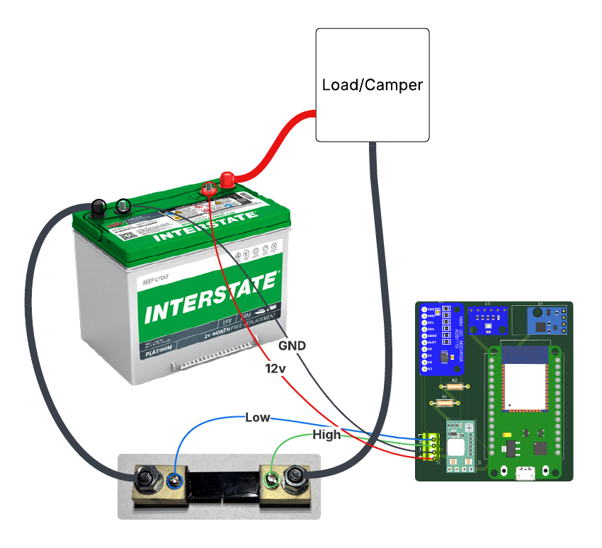
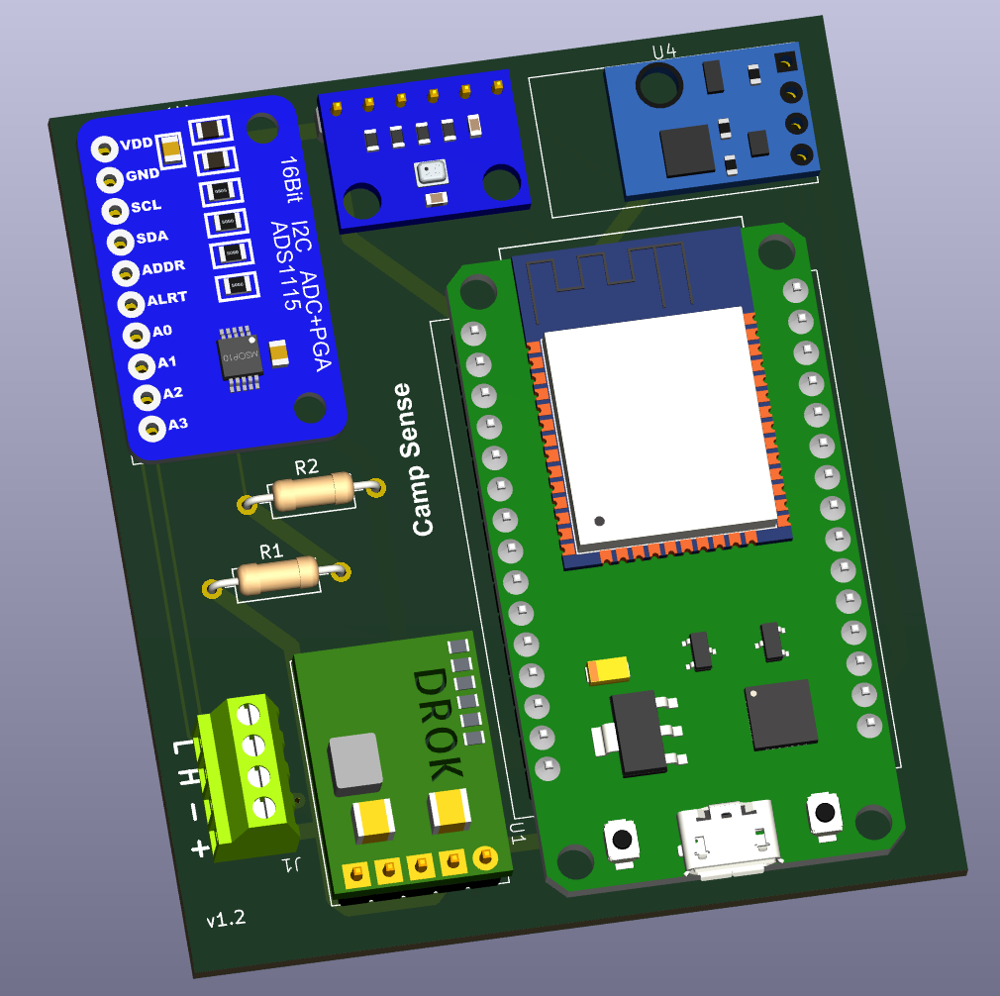
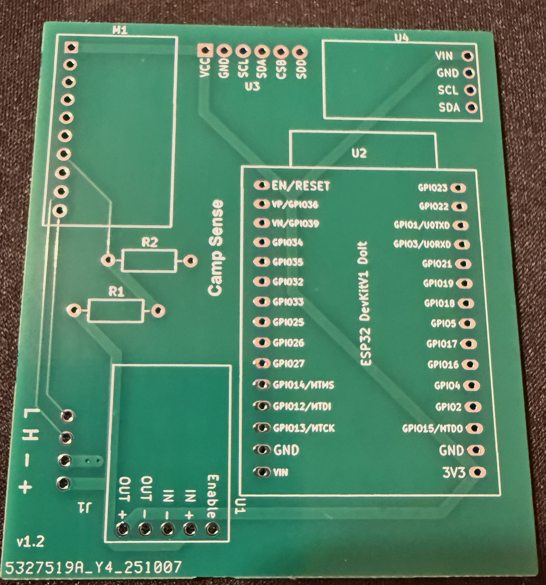

## WattIsIt Hardware

A battery watt meter using ADS1115 and a shunt to measure power usage. The Arduino sketch is located in `Arduino/WattIsIt`. Been using the DOIT ESP32 DEVKIT V1 board.

## Wiring Diagram

**+** Positive battery terminal

**-** Negative battery terminal

**L** Low side of current shunt resistor

**H** High side of current shunt resistor

## Bill of Materials

If using a BME280 on U3 can skip the AHT21 at U4.  The BME280 has tempurature, humidity and pressure/altitude.

| Item             | Link                                             |
| ---------------- | ------------------------------------------------ |
| U2 ESP32         | [https://a.co/d/ff7WulK](https://a.co/d/ff7WulK) |
| M1 ADS1115       | [https://a.co/d/gfCO6jt](https://a.co/d/gfCO6jt) |
| U1 Voltage Reg   | [https://a.co/d/2Gd8mMj](https://a.co/d/2Gd8mMj) |
| U4 AHT21         | [https://a.co/d/6xBWBLx](https://a.co/d/6xBWBLx) |
| U3 BMP280        | [https://a.co/d/1HV9oyw](https://a.co/d/1HV9oyw) |
| U3 BME280        | [https://a.co/d/eRQ7Lw4](https://a.co/d/eRQ7Lw4) |
| J1 Terminals     | [https://a.co/d/8nVocXb](https://a.co/d/8nVocXb) |
| J1 JST Connector | [https://a.co/d/0xq4sMO](https://a.co/d/0xq4sMO) |
| Shunt            | [https://a.co/d/2KoI4U9](https://a.co/d/2KoI4U9) |
| R1 36k Ohm       | [https://a.co/d/88x0EcR](https://a.co/d/88x0EcR) |
| R2 10k Ohm       | [https://a.co/d/gytpesq](https://a.co/d/gytpesq) |
| #10 Ring Terminal| [https://a.co/d/7aQ1Wun](https://a.co/d/7aQ1Wun) |
| M8 Ring Terminal | [https://a.co/d/6IeT5Sb](https://a.co/d/6IeT5Sb) |
| Conformal Coat   | [https://a.co/d/5Z8R07R](https://a.co/d/5Z8R07R) |

## Version 1.2

|                KiCad Model                     |                    PCB                       |
| :--------------------------------------------: | :------------------------------------------: |
|  |  |

## Arduino Code

The Arduino sketch for the WattIsIt module is available in the `Arduino/WattIsIt/` directory. This code handles:

- Reading voltage and current measurements from the ADS1115 ADC
- Calculating power and energy usage
- Bluetooth communication with the mobile app
- Temperature and humidity sensing
