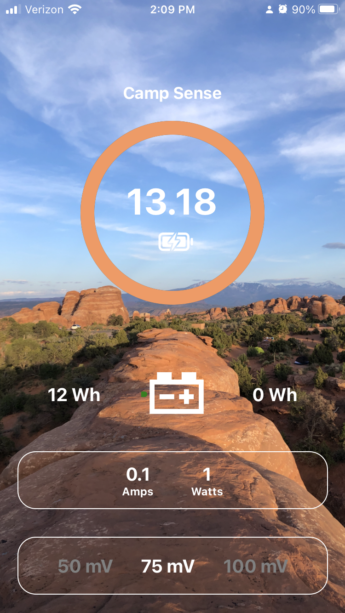
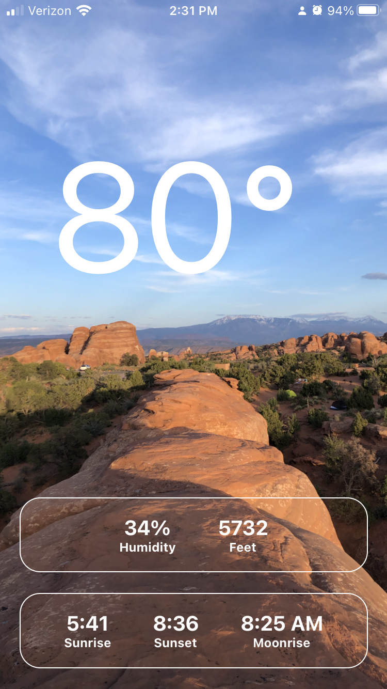

  
The Camp Sense app connects to the WattIsIt ESP32 hardware module via Bluetooth and displays battery energy usage and weather data.

  
  
The app shows current amps into (charging) or out (discharging). A total count shows how many watt hours went into and out of the battery. Long press the battery on screen to reset the Wh counters.

  
  
Your shunt will have a voltage drop rating of 50mV, 75mV or 100mV. Long press the setting to set this for your shunt resistor.

  
  
Access the weather screen by swiping left (and right on weather to return). The app is built with React Native using Expo.

  

    <h3>🔋 Energy Monitoring</h3>
    
Real-time battery monitoring with current, voltage, and watt hour totals for charging and discharge.

  

  

    <h3>🌤️ Weather Data</h3>
    
Weather information from sensors and astronomy data based on your location

  

  

    <h3>📱 Mobile App</h3>
    
Cross-platform React Native app for iOS and Android (maybe)

    

  

  

  

    <h3>🔧 ESP32 Hardware</h3>
    
Custom PCB with ADS1115 ADC and Bluetooth connectivity. KiCad files provided, see <a href="/hardware">hardware</a>

  

  

    <h3>Open Source</h3>
    
Complete source code available on GitHub including React Native app, Arduino sketch, and KiCad PCB files

    <a href="https://github.com/dustinb/CampSense" target="_blank" rel="noopener" class="github-link">
      <svg class="github-icon" viewBox="0 0 24 24" fill="currentColor">
        <path d="M12 0c-6.626 0-12 5.373-12 12 0 5.302 3.438 9.8 8.207 11.387.599.111.793-.261.793-.577v-2.234c-3.338.726-4.033-1.416-4.033-1.416-.546-1.387-1.333-1.756-1.333-1.756-1.089-.745.083-.729.083-.729 1.205.084 1.839 1.237 1.839 1.237 1.07 1.834 2.807 1.304 3.492.997.107-.775.418-1.305.762-1.604-2.665-.305-5.467-1.334-5.467-5.931 0-1.311.469-2.381 1.236-3.221-.124-.303-.535-1.524.117-3.176 0 0 1.008-.322 3.301 1.23.957-.266 1.983-.399 3.003-.404 1.02.005 2.047.138 3.006.404 2.291-1.552 3.297-1.23 3.297-1.23.653 1.653.242 2.874.118 3.176.77.84 1.235 1.911 1.235 3.221 0 4.609-2.807 5.624-5.479 5.921.43.372.823 1.102.823 2.222v3.293c0 .319.192.694.801.576 4.765-1.589 8.199-6.086 8.199-11.386 0-6.627-5.373-12-12-12z"/>
      </svg>
      View on GitHub
    </a>
  

  <h2>App Screenshots</h2>
  <table>
    <tr>
      <th>Energy Monitoring</th>
      <th>Weather Display</th>
    </tr>
    <tr>
      <td></td>
      <td></td>
    </tr>
  </table>

  <h2>Quick Links</h2>
  <ul>
    <li><a href="/hardware/">🔧 Hardware Details</a> <small>ESP32 WattIsIt module specifications and materials</small></li>
    <li><a href="/app/">📱 App Information</a> <small>React Native app features and usage</small></li>
    <li><a href="/privacy/">🔒 Privacy Policy</a> <small>Data usage and privacy information</small></li>
  </ul>

